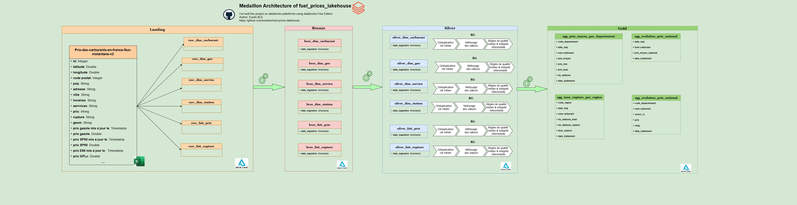

## 📌 Contexte du projet
En France, le prix des carburants peut varier de plus de 20 centimes par litre entre deux stations à quelques kilomètres d'écart - une info publique, mise à jour en continu par le Ministèree de l'économie via [https://data.economie.gouv.fr/](https://data.economie.gouv.fr/), mais difficilement exploitable telle quelle (format imbriqué XML->JSON, structure large avec une colonne par carburant, ruptures de stock non structurées).

Ce projet transforme ce flux brut en un modèle de données prêt pour l'analyse, capable d'alimenter un comparateur de prix, un outil d'optimisation de données pour une flotte professionnelle, ou un suivi de ruptures d'approvisionnement en temps réel. 

## 🎯 Objectifs
- Ingérer le flux brut publié par [https://data.economie.gouv.fr/](https://data.economie.gouv.fr/) (téléchargement HTTPS, décompression gzip)
- Nettoyer et fiabiliser les données  (gestion des lignes corrompues, encodage, séparateurs)
- Désimbriquer les structures JSON contenues dans les colonnes CSV(services, prix)
- Modéliser les données en schéma en étoille (FAIT_PRIX, FAIT_RUPTURE, DIM_STATION, DIM_CARBURANT, DIM_GEO)
- Gouverner les accès et isoler les environnements dev/prod (Unity Catalog)
- Industrialiser le pipeline (modules python testables, orchestration via DAB-Databricks Asset Bundles, CI/CD)

## Dataset
### Source
- [https://data.economie.gouv.fr/](https://data.economie.gouv.fr/) - Prix des carburants en France, flux instantané V2

## 🏗️ Architecture Médaillon



Le pipeline suit une architecture en médaillon sur 4 couches Delta Lake :
- **Landing** : dépôt brut du flux `Prix-des-carburants-en-france-flux-instantane-v2` tel que reçu de data.economie.gouv.fr, éclaté en un jeu de tables *raw* (dimensions carburant, géo, service, station et faits prix/rupture).
- **Bronze** : ingestion historisée des tables raw (`brze_*`) avec ajout d'une colonne `date_ingestion` pour tracer chaque chargement.
- **Silver** : nettoyage et fiabilisation des données (`silver_*`) - déduplication par clé métier, nettoyage des valeurs, application des règles de qualité et d'intégrité référentielle (RG).
- **Gold** : agrégats prêts pour l'analyse (`agg_*`) - prix moyen par département/jour, évolution des prix au niveau national/départemental, taux de rupture par région.

## 📁 Architecture du projet

```
fuel-prices-lakehouse/
├── conf/
│   ├── dev.yml
│   └── prod.yaml
├── docs/
│   ├── fuel_price_architecture.drawio
│   └── fuel_prices_medaillon_architecture.jpg
├── fixtures/                       # Jeux de données pour les tests
├── resources/                      # Configuration des jobs et pipelines (DAB)
│   ├── carburant.job.yml
│   └── carburant_etl.pipeline.yml
├── src/
│   └── carburants/
│       ├── __init__.py
│       ├── explorations/
│       │   ├── 01_Landing.ipynb
│       │   ├── 02_Bronze.ipynb
│       │   └── 03_Silver.ipynb
│       └── transformations/
│           ├── 00_data_quality.ipynb
│           ├── file_downloader.py
│           └── main.py
├── tests/
│   ├── conftest.py
│   └── sample_taxis_test.py
├── databricks.yml
├── pyproject.toml
├── README.md
└── .gitignore
